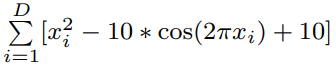
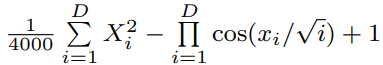
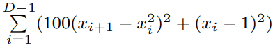

# GPU_SPSO
GPU-based Parallel Particle Swarm Optimization

## Link of the paper
Our project is based on the following paper:<br/>
https://ieeexplore.ieee.org/document/4983119

## Objective functions:
f1:
.

f2:
.

f3:
.

f4:
.


## Constraints
#### Dimensions
In this project, we will look at 4 dimensions:<br/>
50, 100, 150, 200

#### Swarm population
In this project, we will look at 6 swarm populations:<br/>
400, 1200, 2000, 2800, 10000, 20000

#### Domains
f1: (-100, 100)^D<br/>
f2: (-10, 10)^D<br/>
f3: (-600, 600)^D<br/>
f4: (-10, 10)^D<br/>

## Two different ways of running the algorithm
Two methods will be implemented:<br/>
- [ ] Method1: Uses cuRAND to generate pseudorandom numbers on the GPU. The computations are done on GPU. The corresponding file is named main.cu.<br/>
- [ ] Method2: Random numbers are generated on CPU, as well as the computations. This method is used as a comparison. The corresponding file is named main_CPU.c.<br/>
<br/>

## How to run on Pace
### For the GPU code:

1) Load the cuda module:

    ```
    prompt% module load cuda
    ```
2) Delete the previously compiled example:
    ```
    prompt% make clean
    ```
3) Compile the example:

    ```
    prompt% make
    ```

    The Makefile contains many useful bits of information on how to compile a CUDA code

4) Submit the example to PBS. As the example is based on f1, submit the corresponding file:

    ```
    prompt% qsub run_f1.pbs -q pace-ice-gpu
    ```
    
    ### For the CPU code:

