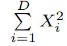

# GPU_SPSO
GPU-based Parallel Particle Swarm Optimization

## Link of the paper
Our project is based on the following paper: 
.

## Objective functions:
f1:.

f2:.

f3:.

f4:.

## Constraints
#### Dimensions
In this project, we will look at 4 dimensions: 
50, 100, 150, 200

#### Swarm population
In this project, we will look at 4 dimensions: 
400, 1200, 2000, 2800

#### Domains
f1: (-100, 100)^D 
f2: (-10, 10)^D 
f3: (-600, 600)^D 
f4: (-10, 10)^D 

## First step: Random number generation
Two methods will be implemented: 
- [ ] Method1: M (M >> D∗N) random numbers are generated on CPU before running SPSO. Then they are transported to GPU once for ado and stored in an array R on the global memory. 
- [ ] Method2: Uses cuRAND to generate pseudorandom numbers on the GPU.     
